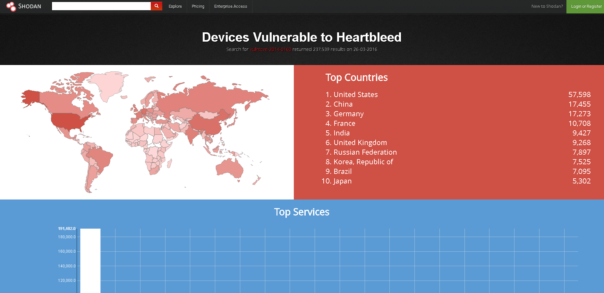
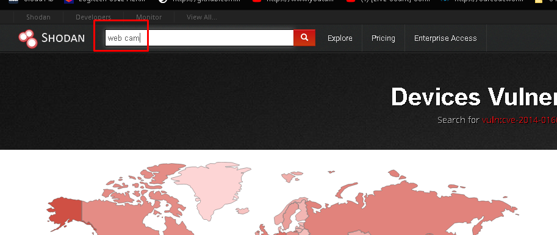
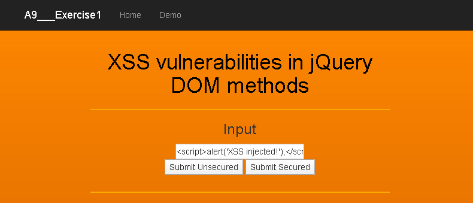
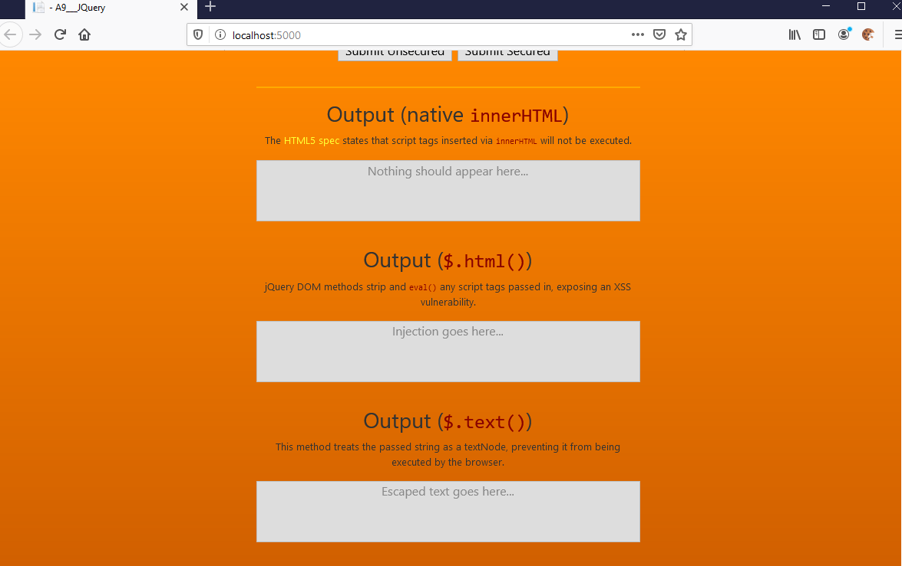
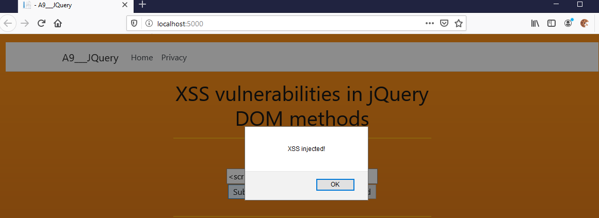
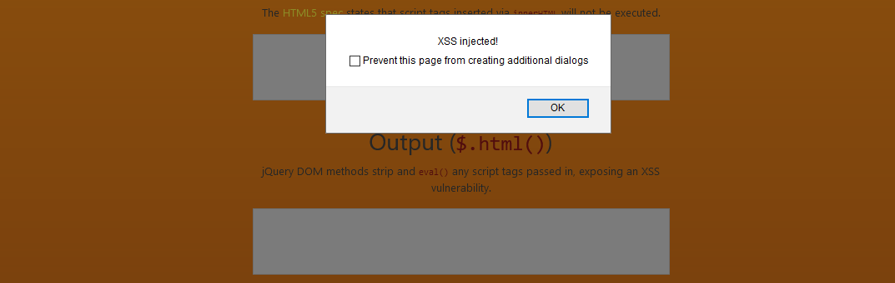
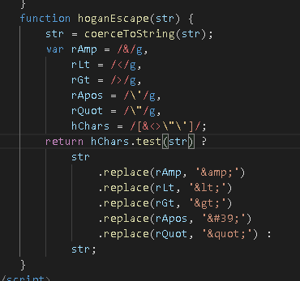
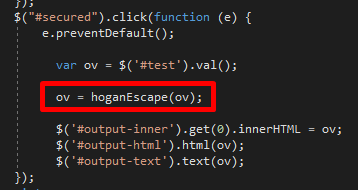
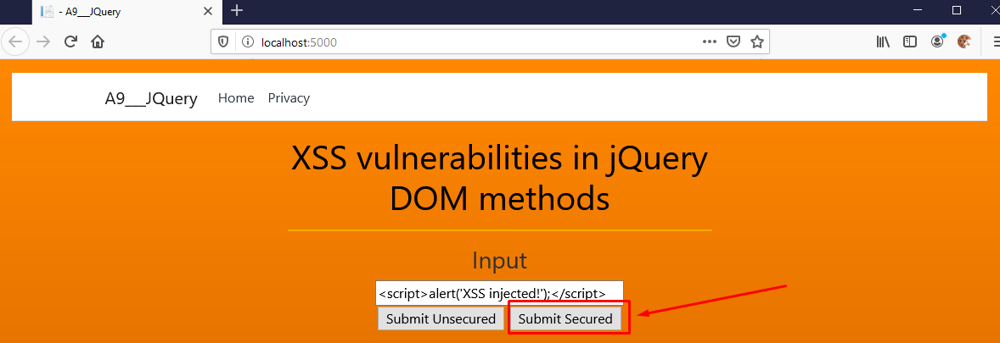
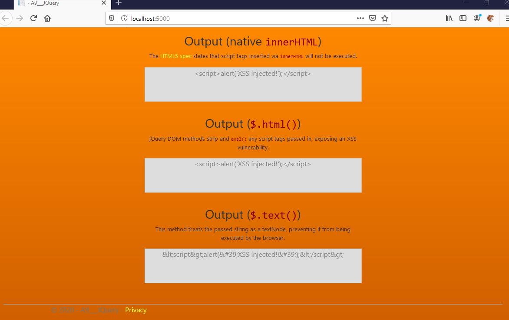

[OWASP Top 10 2017 - A9 Components with known vulnerabilities](https://www.google.com/url?q=https://youtu.be/bQWF29ujBpk&sa=D&ust=1581704323999000)

1.  Here in video 9 item A9 from the OWASP top 10 2017 list

1.  We have a non mover using components with known vulnerabilities

1.  This has a grid which canisters will exploit ability is a little bit variable depending on what exactly the vulnerability is.

1.  If you have a vulnerability in something like a public-facing web server

1.  Then it's likely to be more exploitable than a vulnerable component or library that's hidden below the surface that's not necessarily visible

1.  Although this is very common  not all vulnerabilities are as easy to exploit as others

1.  And as I mentioned detectability can vary depending on where exactly the vulnerability is.

1.  The technical impact of a vulnerability could be severe

1.  Because we could be talking about remote code execution and full access to a certain machine or a certain application

1.   We've got a little bit of a mixed bag here depending on what exactly your application does and what it uses

1.  Some of these exploits can only really be done manually and although you do have automated tools which we'll look at a bit later

1.  That can help you find some of these vulnerable components actually taking advantage of that

1.  It is not always just hitting a button and taking advantage

1.  There might be some extra work required to try and tailor or customize that attack for a particular system

1.  When we talk about components with no vulnerabilities we've got some examples here

1.  A very classic example is we use the software library and we either don't keep up to date with any vulnerabilities that might be found in that library.

1.  Or sometimes we don't even consider them right at the beginning

1.  We find a library to do a piece of functionality let's say for example to deserialize an XML document

1.  If we don't have that built into our framework or built into the operating system we find a library online.

1.  We use it and we don't even consider that there might already be a known vulnerability.

1.  And very often that vulnerability might only include a very specific piece of functionality.

1.  We might be able to switch these things off and disable stuff that we don't need.  
    
2.  If we use these libraries and we're not really keeping up to date with vulnerabilities

1.  Then we  put ourselves at risk. A similar risk is when we use libraries from untrusted sources.

1.  This can happen even if you're using a very popular framework.

1.  It certainly happened to me in .NET experience when looking for something very specific and finding one library that's any good.  
    
2.  That seems to be fairly functional you might take that library without really thinking about who's written this library.  
    
3.  Is it somebody who knows how to write a secure piece of software is it from even a foreign government or something that could have questionable motives.  
    
4.  We can use libraries without thinking about the risk that we introduce but a maybe a more well-known scenario is using server software or components like your Apache web server like iOS like Nginx  
    
5.  Like anything else and especially since a lot of functionality might be enabled by default when we install these systems.  
    
6.  We're vulnerable not just to things that we are actually using and that we know that we're using but we're also vulnerable to systems that just happen to be turned on and we haven't switched them off.  
    
7.  It all comes back to knowing what versions of software we're using and whether they have known vulnerabilities and then  in some ways this can apply to anything.  
    
8.  Any component that you haven't specifically written could refer to a database engine, operating system, etc.  
    
9.  Any other components that we use outside of our main application are all potential risks and  some of them are ease to take advantage of than others  
    
10.  In most cases, anything that faces the public Internet is going to be more vulnerable than something like an operating system or a database engine which is generally going to be protected by other systems.  
    
11.  We do need to consider more than just libraries and our server software.  
    
12.  In general this is an issue when we have no process for monitoring and updating components our libraries our server software then we're vulnerable by definition because anything can have a vulnerability that gets discovered after the software has been released and so often we just don't have any  view of this in any consistent way.  
    
13.  We might have a good view of our main application but what about our business applications or  what about systems we don't use very much but still they're they're still visible to the Internet and they're still vulnerable  
    
14.  Anytime we don't have a process in place for regularly keep it on top of this then we're vulnerable  
    
15.  In terms of how common it is, we could probably say that pretty much every system that you will work on has a vulnerability somewhere.  
    
16.  In one or more of the components! Not only does it exist in many places like we mentioned earlier …  
    
17.  … databases or web servers or libraries of components or even online services but that said they won't all be exploitable  
    
18.  You might have, let's say, a vulnerability in your database engine but because that piece of functionality is not used in your application then there would be no way for an attacker to actually get to that piece of vulnerability to exploit it.  
    
19.  Not all vulnerabilities are equal. It will depend very much on your application and how much functionality is exposed.  
    
20.  How much is blocked off and how much is disabled.  
    
21.  We've got such a wide spectrum here from very obvious, very detectable, very easy to exploit.  
    
22.  Vulnerable is right through two vulnerabilities that are largely impossible to take advantage of and from the show a couple of examples really of how easy these things can be discovered.  
    
23.  The first one is a search engine called shodon and it's primarily designed for finding Internet of Things devices.  
    
24.  Shodon is linked from the OWASP top 10 document. If you want to find this link you can find it there and it's a historical report taken from 2016.  
    

<table class="c26">

<tbody>

<tr class="c34">

<td class="c24" colspan="1" rowspan="1">

[https://www.shodan.io/report/89bnfUyJ](https://www.google.com/url?q=https://www.shodan.io/report/89bnfUyJ&sa=D&ust=1581704324007000) 

</td>

</tr>

</tbody>

</table>

1.  It reports devices that are vulnerable to the heartbleed vulnerability. This was a major vulnerability you can see there at CVE 2014 - 0-1-6-0\.  
    
2.  Heartbleed was a way to take advantage of SSL encryption and potentially - to hijack the encrypted data.

1.  You can see there that in 2016 nearly 60,000 sites that were found that were vulnerable just in the United States alone.  
    
2.  We're talking about loads of sites probably very often sites that were forgotten about or maybe they were set up five years ago and not actively maintained.  
    
3.  You can see the amount of vulnerability just from one single issue and this is purely from a search engine.  
    
4.  What Shodon is often used for is to search for things like webcams[[a]](#cmnt1). You can see the various countries it finds information and it tries to ping things it thinks are webcams.

  

1.  This one's in United Kingdom amol bruh and you can open this in another tab I'm not going to do it because I don't know I don't know what's there although that's a Raspberry Pi  
    
2.  It's probably nothing terrible but it's as easy as this to find public information on services that are running on the public Internet.  
    
3.  That's one example of how an attacker might look for something very specific.  
    
4.  That report we were looking at is actually a type of search where you can search for a vulnerability.  
    
5.  Specifically and then what shodon will do is it will find versions of web servers or whatever that it knows to be vulnerable and it will return that in the results.  
    
6.  You do have to register if you want to use vulnerability searching but  if you were a criminal or whatever you would probably pay that money to get the power of shodon and other tools.  
    
7.  That's one example another example is basically a scanning tool  
    
8.  There are several there probably ten or twenty fairly widely used vulnerability scanning tools.  
    
9.  These are tools that are more likely to be used on an internal network or as part of a formal pen test.  
    
10.  We could look across multiple machines across subnets we could be looking inside a company Network.  
    
11.  Let's ignore the firewall for now and let's assume we're inside.
12.  Are we still vulnerable inside because as we know people are often very good at putting strong firewalls in place for external attacks …  
    
13.  … but don't necessarily consider the types of attacks that could come from inside the network.  
    
14.  One of these is openvz which is a suite of tools made by a company called Green bone  
    
15.  I'm just going to show you an example of going to is a Kali Linux VM I'm running on my host machine and into here.  
    
16.  I've already run a vulnerability scan on the host machine. This is the virtual machine and I've run this against the host.  
    
17.  That's my internal IP address there 102 168 56 1 and as I've scanned this.  
    
18.  It's only found a single vulnerability [[b]](#cmnt2)which is probably not very surprising. I have a simple desktop machine  not running hundreds of services.  
    
19.  Even here it's already found one vulnerability. One it considers a medium risk and if I click on this report log in again you can see it's listing a vulnerability.  
    
20.  This is our PC enumeration and what this is is a port where you can go to a Windows machine and say what distributed comm operations are running on this machine and it will tell you what they all are.  
    
21.  It's not necessarily a terrible vulnerability. In this case, this would only be visible from my internal network and might tell me there's a printer service running.  
    
22.  Stuff like that if that was a problem  I could close this port down on the firewall run the scan again and make sure it's not vulnerable.  
    
23.  These can take a significant amount of time because they're searching through lots of vulnerabilities lots of pieces of software we're talking about  thousands of entries.  
    
24.  What will often happen is people will set these up and maybe leave them running overnight.  
    
25.  Especially if they're running against an entire network and in an enterprise situation you could have hundreds of desktop machines and servers.  
    
26.  It might only be one or two of them that are running some unexpected software or some old versions that a tool like this can pick up on Hanken and can show you what's going on.  
    
27.  That's the way a professional pen tester would approach vulnerability scanning.  
    [[c]](#cmnt3)
28.  When we talk about fixing it I mean knowing there are vulnerabilities and keeping up to date.

1.  The very first one we've seen several times now in the top ten remove anything that you don't need.  
    
2.  If you've got components in your application and you're not sure what they're for then find out whether you can just remove them.  
    
3.  Does your application still build and run? Depending on your application that might be easy or not.  
    
4.  Any dependencies on external services on external servers might be some of these things that you could only really to be wired up when we're running a backup, for example.  
    
5.  Maybe we can leave it disabled most of the time and only switch it on for backups.  
    
6.  Removing the attack surfacealways makes things better and then using tooling to automate version management.  
    
7.  This is a massive subject but every platform (Windows, Linux, Mac, etc.) has tools that can give you a network-wide view of what versions are software are running.  
    
8.  Particularly you are looking for web servers, any public accessible services like publicly visible databases, etc.    
    
9.  When I use the word public I mean services visible on the network rather than just an internal service on a single machine.  
    
10.  You could use tooling like that which you have to pay for but it's giving you insight into your system.  
    
11.  Not only could software be out of date but you probably want to know that as well.  
    
12.  To know if all of the versions of software you're using certainly the ones that are visible to a scanning tool are vulnerable.  
    
13.  It doesn't work against things like software libraries because the versions of software libraries are not visible generally to the public network.  
    
14.  You could consider a health check page on your applications which Kurds are perhaps producing JSON data which your scanning tools might be able to consume.  
    
15.  Then know you're using this version of Apache and that version of .NET or whatever it might be.  
    
16.  NOTE: this is very similar to a concept in web performance metrics and, in fact, really must be part of every web developers practice.  
    
17.  I’ll spend some time on this during the course. [https://developers.google.com/web/tools/lighthouse/audits/budgets](https://www.google.com/url?q=https://developers.google.com/web/tools/lighthouse/audits/budgets&sa=D&ust=1581704324014000), [https://www.uptrends.com/what-is/Web-Performance-Monitoring](https://www.google.com/url?q=https://www.uptrends.com/what-is/Web-Performance-Monitoring&sa=D&ust=1581704324014000),

[https://www.verizondigitalmedia.com/blog/better-website-security-for-enhanced-web-performance/](https://www.google.com/url?q=https://www.verizondigitalmedia.com/blog/better-website-security-for-enhanced-web-performance/&sa=D&ust=1581704324015000)  

(this may not fit here but it is a topic we should consider preparing for.  I checked the gtmetrix score of [www.icao.int](https://www.google.com/url?q=http://www.icao.int&sa=D&ust=1581704324015000) and its 21% for desktop.)

1.  Using tooling really is the big one here to automate this as much as possible  you should try and only use legitimate libraries.  
    
2.  There's a trust issue when you use anything from a third party you can never be completely sure.  
    
3.  If you use libraries component services from a vendor especially one that you're paying[[d]](#cmnt4) for there's a better chance that you're getting a commercial deal and not just somebody trying to sell a library that has vulnerabilities in it …    
    
4.  … or somebody who's  glued something together in their spare time but which doesn't work well and which causes a security problem for you later on.  
    
5.  the more legitimate you can use the better and  we've got to get used to paying for things paying for quality you can get good stuff for free but you can't always get what you need for free  
    
6.  Sometimes we need to pay to get that level of trust. Perhaps what we’re looking for in this relationship is the feeling of trust that comes with financial accountability.  
    
7.  We then need to have a policy and a process for unmaintained components.  
    
8.  If you've got something there that's an old library that's not maintained anymore what are you going to do about that because you're not going to be able to patch something that's not being maintained and probably more importantly you're possibly not going to know about any vulnerabilities that exist in that because in general it's going to be the maintainer of a component that are likely to be aware of vulnerabilities because usually they would be told by anybody who discovers the vulnerability  
    
9.  you could have a policy of process that says  we're not going to use our maintain components or we're going to  hide them from the public Internet or the next point here is you can deploy additional controls  
    
10.  you could say well although this component of my web server isn't maintained anymore if I put another firewall in front of my web server that has some extra functionality I might be able to filter the types of attack attack data that is actually going to take advantage of the vulnerability  
    
11.  by adding additional controls additional levels of  depth then I might be able to mitigate some of the risk from things that I can't patch we've mentioned this before as well in terms of vulnerable components if you've got something that needs to carry out an action on the operating system or do something maybe a little bit more privileged consider using sandboxing  
    
12.  using a virtual machine using a another machine another server to try and keep the risky part of the operation away from the rest of the application or away from the database or away from the rest of the network  
    
13.  at least then if somebody does take advantage you're exposing the minimal and minimum amount of data that you can and for example if somebody takes over your sandbox term machine then they're not going to be able to see a database because there's going to be no connection they're to the database server  
    
14.  you might be able to do something with that depending on what you're doing another one is about consistency  
    
15.  particularly as soon as your company is more than about 10 or 20 people the number of pieces of equipment you have just starts going up  in a crazy fashion some large enterprises probably have  five machines for every employee they have  
    
16.  you could be talking about thousands and thousands of deaths desktops and servers and telephone exchanges and security systems  any other special equipment SCADA systems IOT all of these things that are all sitting on the network somewhere  
    
17.  having consistency makes your life easier and what one example of using that is having continuous deployment of of your production systems  
    
18.  that when you push a new deployment  that the versions of Apache are the same the versions of.net of PHP whatever it is you're using are always the same  
    
19.  then when you need to make an update you only need to update one script in your CD system and then  that all environments from that point onwards are  going to be using the the new the new version but the same algoes for every other system you deploy how you're going to keep that consistency how are you going to make sure that you don't deploy an old version of PHP because you haven't gone back to that server and touched it for five years  
    
20.  there's lots of this is processed lots of its tooling it's all going to be fairly complicated and probably worth sending somebody on some decent training for just to make sure that you've got that visibility and another maybe more modern way way of mitigating the risk is to consider transferring the risk to software as a service  
    
21.  that you don't have to maintain underlying operating systems or versions of software  
    
22.  for example if you run Redis cache on your own machine you've got to maintain your prezi system you've got to maintain the version of Rhenish and any other dependencies it has if you were to use say as your reddish or AWS ready then it's up to the cloud provider to manage the OS and its updates and it's up to them to manage the version of Redis and all its dependencies  
    
23.  You get to transfer the risk to somebody who's probably set up better than you are to manage those versions and to avoid those vulnerabilities  
    
24.  nothing really again very specific we can say here this is quite a general general topic quite a general thing to consider but probably this is going to be one of the the more complicated and long-winded implementations for you because it does is going to consist of tooling of different people in different departments in charge of different parts of your overall infrastructure and all of the  the subtleties and details involved there but as with all of these don't be put off by the amount of work having something is better than having nothing if 90% of your infrastructure is brilliant and you can't really deal with the other 10%  then that's better than not dealing with all of it  
    
25.   try by starting and doing something you'll soon learn the ways in which this stuff works and doesn't work  
    
26.   that's it for a nine again reminder please read the top ten publications some of the links that I've used are in that some of the cheat sheets and the explanations and everything are all in their search for a wasp top ten on your favorite search engine and you'll find hopefully what you need to find out any questions or comments please Chuck them on the video below otherwise I will see you in the next video  

A9 – Using Components with Known Vulnerabilities Exercise

1.  JQuery html method is vulnerable to DOM-Based XSS vulnerability  
    
2.  This is an exercise about how to exploit and prevent the vulnerability. Go to Demo Page.  
    

1.  We have two buttons, unsecured and secured submit.  
    

1.  Then we have three outputs that compares three methods, innerHTML, html, and text.  
    
2.  innerHTML: The HTML5 spec states that script tags inserted via innerHTML will not be executed.  
    
3.  Html: jQuery DOM methods strip and eval() any script tags passed in, exposing an XSS vulnerability.  
    
4.  Text: This method treats the passed string as a textNode, preventing it from being executed by the browser.  
    
5.  Now let’s go and start its demo, Let’s click submit unsecured.  
    

1.  Let’s Comparing the three methods  
    
2.  Nothing appeared in the output of innerHTML, which means it’s not vulnerable to such exploits.  
    

  

1.  While output of html have successfully been exploited and the script have succeeded.  
    

  

1.  And the output of text, prints out the script in text, which means it’s also not vulnerable to such exploits.

Solution  

1.  Goto /Views/Home/Demo.cshtml

1.  I have created hoganEscape method and applied it on Submit Secured Button onclick

1.  Let’s review hoganEscape logic.

  

1.  Then we can use the method to escape the input value on submission in Submit Secured button..  
    

  

1.  Now try clicking submit secured, the script should not perform. But instead, paste the whole text in their respective output boxes.  
    

[[a]](#cmnt_ref1)+mark.raymer@anomalistdesign.com I'm editing this "just in case" I need it. I notice he talks about Shodon here and maybe you can take this as an idea for an example in OSINT?

_Assigned to Mark Raymer_

[[b]](#cmnt_ref2)this one may be hard to replicate.

[[c]](#cmnt_ref3)no demo for the red lines

[[d]](#cmnt_ref4)+pete@anomalistdesign.com I do not share his confidence that pay equals secure.  I think I'd like that blunted here.

