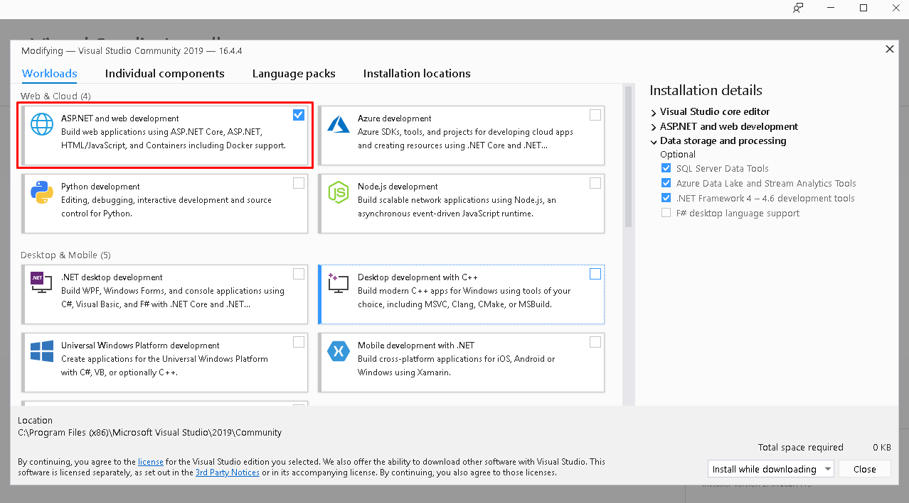

# TOP-10-OWASP-DEMO

## Download and Install all Requirements in the list below

|Software | Download Link |
|--- | --- |
| SQL Server 2019 Developer | https://go.microsoft.com/fwlink/?linkid=866662 |
| SQL Server Management Studio (SSMS)| https://aka.ms/ssmsfullsetup |
| Visual Studio 2019 | https://visualstudio.microsoft.com/thank-you-downloading-visual-studio/?sku=Community&rel=16 |
| Chrome Browser | https://www.google.com/chrome/ |
| Firefox Browser | https://www.mozilla.org/en-US/firefox/download/thanks/ |
| Cookie Quick Manager (Firefox Extension) | https://addons.mozilla.org/en-US/firefox/addon/cookie-quick-manager/ |
| Burp Suite (Community Edition) | https://portswigger.net/burp/releases/community/latest |

## Installing Visual Studio 2019

1. Make sure to install `ASP.NET and web development`. See screenshot below.

## Importing database

1. Install `SQL Server Management Studio (SSMS)`, see download link above.
2. Clone this repository in your computer.
3. Find and Open `OWASP.sql` inside the repository.
4. SSMS will appear, connect to your sql server if connection box appears.
5. Select the script and click execute.

6. To see changes, right click into `Databases` and click refresh.

## Burp Suite Setup

1. Install `Burp Suite (Community Edition) `, see download link above.
2. Open up `Burp Suite (Community Edition) `.
3. Select `Temporary Project` and click `Next`.
4. Select `Use Burp defaults` and click `Start Burp`.
5. Click `Proxy` tab.
6. Under the `Proxy` tab, click `Options` tab.
7. Find `Intercept Client Requests` section.
8. Copy the settings in the screenshot below.

9. Under the `Proxy` tab, click `Intercept` tab.
10.  Turn off `Intercept` for now by clicking `Intercept is on`.
11. Open up `Firefox Browser`.
12. In the address bar, type and enter `about:config`
13. Click `Accept the Risk and Continue`
14. In the `Search preference name` search input box, type in `hijacking`
15. Set `network.proxy.allow_hijacking_localhost` setting to `true` by clicking toggle button. See screenshot below.

16. Click `Open Menu`, and click `Options`. See screenshot below.

17. In the `Find in Options` search box, type in `proxy`, then click `Settings` under Network Settings. See screenshot below.

18. Select `Manual proxy configuration`, then set `HTTP Proxy` to `localhost` with `Port` set to `8080`. See screenshot below.

19. Lastly, Click `OK`